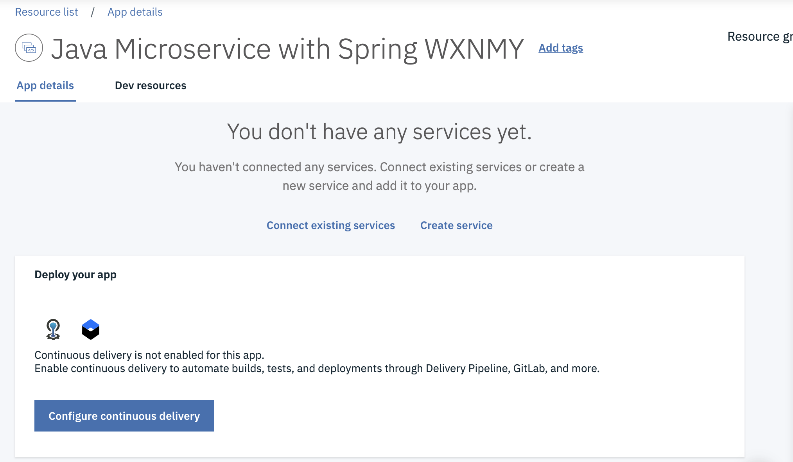
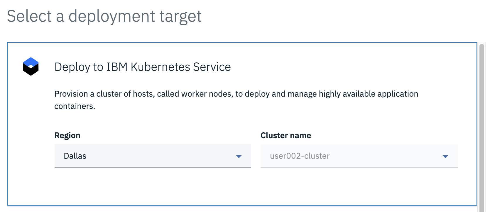
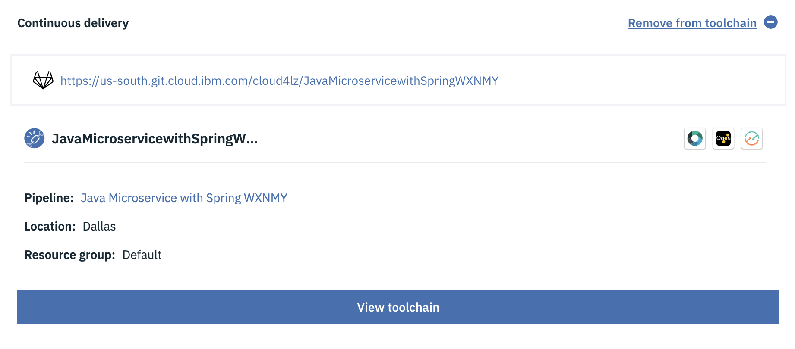

# Develop a Java Microservice with Spring Boot

IBM Cloud provides `Starter Kits` as the starting point of quick cloud native development and deployment. For example
   * Java Microservice with Spring
   * Java Microservice with Eclipse MicroProfile and Java EE
   * Node.js Microservice with Express.js
   * Python Microservice with Flask

In this session, you develop a Java Microservice using the `Java Microservice with Spring` starter kit. With this kit, you can have a basic Java microservice developed and deployed in a few minutes. You create a CI/CD pipeline in IBM Cloud which automates your service's deployment to Kubernetes cluster.

The Java source code is available in the Git repo that is created as part of the CI/CD pipeline. It can serve as a starting point of your development project. You can download the repo to your local machine, develop and test your service locally, then check in the complete version of your project back to your Git repo. This will trigger a re-build and re-deployment process. The latest version of your microservice is deployed and running in Kubernetes cluster.

The instructions were adapted from the more comprehensive tutorial found here - https://cloud.ibm.com/docs/apps/tutorials?topic=creating-apps-tutorial-scratch#prereqs-scratch.


## Create a Java Microservice with Spring Boot

To createa a Java Microservice with Spring Boot using the starter kit,

1. Login to IBM Cloud.

1. Select `Catalog` in your account dashboard.

1. Search and select the `Java Microservice with Spring`.

1. Accept the default settings and click `Create`.


## Create a Continuous Delivery pipeline

`Continuous Delivery` automates builds, tests, and deployments of your service through Delivery Pipeline, GitLab, and more. By default, it is not enabled.

To enable the continous delivery for your service,

1. On the `App details` page, scroll down to the `Deploy your app` section.

2. Click `Configure continuous delivery`.



3. Select the `Deploy to IBM Kubernetes Service` option.



4. Select the desired `Region` and `Cluster`.

5. `Next`.

6. Accept the defaults and `Create`.

7. It may take a few minutes to complete the `Continuous Delivery` configuration.



8. Click `View toolchain`.

   A `Git repo` is created for storing the source code of your service development project. It also provides version control service.

   A `Deliver Pipeline` is also created. It automates builds, tests, and deployments of your service.


9. Select the `Delivery Pipeline`.

10. The `Delivery Pipeline` should run through its stages. This may take a few minutes. After it completes, you should see **Stage Passed** messages for each stage.


## Verify your service

Now, your microservice is running in Kubernetes cluster of IBM Cloud.

* To find out how your servoice can be accessed, execute commands below

   ```
   ibmcloud ks workers <your cluster>

   kubectl get svc
   ```

   Locate the `Public IP` and `Port(s)`.

* To verify your microservice, enter http:<Public IP>:<Port> in a browser.


